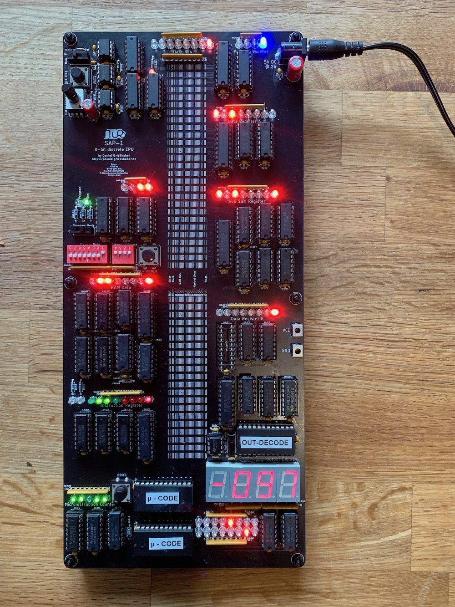

.. SAP-1 Processor Architecture documentation master file, created by
   sphinx-quickstart on Wed Aug  7 08:08:43 2019.
   You can adapt this file completely to your liking, but it should at least
   contain the root `toctree` directive.

============================
SAP-1 Processor Architecture
============================

A simple 8-bit micro-processor using mostly discrete logic chips.

This project is mostly based on the `8-bit Breadboard computer <https://eater.net/8bit>`_
by `Ben Eater <https://eater.net>`_

   Overview of the assembled processor board running `Example-Programs/Counter.s`

Banner Specs
============

- ~400 Hz Clock
- 8-bit Data Bus
- 16-bit Control Word
- 5 Microsteps per Instruction
- 16 byte RAM

Source (I want to build my own)
===============================
Check the projects `Github <https://github.com/dangrie158/SAP-1/>`_ for all files neccecary.

Submodules
==========
- Clock with adjustable frequency and single-step button
- 2 8-bit Data Registers (A & B)
- ALU implementing sum and difference between Registers A & B,
    carry and zero flag
- Flag Register to save the ALU flags between instructions
- 4-bit Instruction Counter with load (jump)
- Output module to display a byte as positive decimal or
    2s-complement with data latch
- Random Access Memory with 16 Bytes for instructions and data
- 4-bit Memory Address Register to address the 16 bytes of RAM
- 8-bit Instruction Register with the upper nibble representing
    the opcode, the lower nibble can be used for instruction parameters
- Instruction Decoder to run the microcode of the 16 different instructions
    with 5 microinstuctions each. Uses a 16-bit control word to control the
    other modules

Writing Code
============
The documentation has an extensive section on the
`Instruction Set Architecture <https://dangrie158.github.io/SAP-1/isa.html>`_
you can use to get started writing programs.

Assembler
++++++++++
In the ``Tools`` directory an assembler is available that can
either output binary files or, if it detects stdout to be a TTY,
prints programming instructions for you to manually program the RAM
using the DIP-Switches.

.. code:: bash

    $ cat Example-Programs/Counter.s
    .data:
    0xF: 0x1

    LDA 0xF
    loop:
    OUT
    ADD 0xF
    JMP loop

    $ Tools/sap-asm Example-Programs/Counter.s
    ○○○○: ○○○●●●●●
    ○○○●: ●●●○○○○○
    ○○●○: ○○●○●●●●
    ○○●●: ○●●○○○○●
    ●●●●: ○○○○○○○●

    $ Tools/sap-asm Example-Programs/Counter.s | hexdump
    0000000 1f e0 2f 61 00 00 00 00 00 00 00 00 00 00 00 01
    0000010

Programming the EEPROM LUTs
===========================

The provided ``Makefile`` offers some convenient rules to
create the LUTs and program them to an EEPROM.
To program the LUTs you can use an
`Arduino based programmer <https://github.com/dangrie158/EEPROgraMmer>`_
with only 2 external chips (+EEPROM) which is the officially
supported method using the `eepro <https://pypi.org/project/eepro/>`_
CLI.

However, you can also use any other programmer to flash
the binary files created by the scripts.

If you want to use ``eepro``, make sure the package is installed

.. code:: bash

    pip3 install -r requirements.txt

Then you can programm the needed 3 EEPROMS (1x Output Decoder,
2x Microcode) using:

.. code:: bash

    make program_lut file=LUTs/microcode.bin     # < for the microcode EEPROMS
    make program_lut file=LUTs/outputdecoder.bin # < for the Out Decoder EEPROM

The rule makes sure the LUTs are created or updated if
the creating script has changed since last creation.

If you want to use any other programmer, just run

.. code:: bash

    make luts

to create the binaries in the ``LUTs/`` directory.

.. toctree::
   :maxdepth: 3
   :caption: Contents:

   isa
   block-diagram
