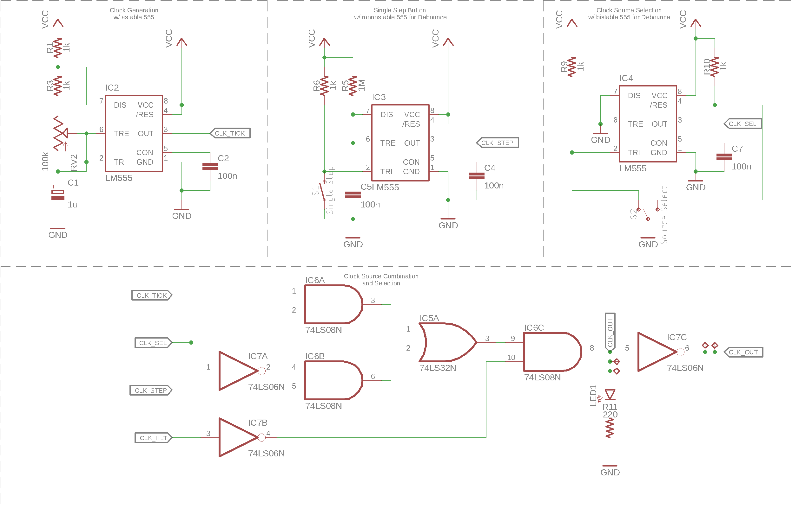

===========
Clock (CLK)
===========
The clock module is responsible for all time related coordination
between the seperate modules.

Mode of Operation
=================
The module has 2 outputs that feed into the other modules,
the **positive clock line** (:math:`CLK`) and its
**logical inverse** (:math:`\overline{CLK}`).
The :math:`\overline{CLK}` signal is always low when the clock signal is
high and vice-versa, this way the processor has 2 clock signals that are
on a 180° phase difference.

The source for the clock pulses is selectable via the **Source Select**
switch and can either be set to *run* mode or *single-step*.

*Run* mode
----------
In *run* mode, the clock signal is created by a 555 timer in astable
configuration. The dutycycle of the signal is 50%, while the frequency
can be set using a potentiometer.
The clock frequency is set by :math:`\mathrm{CLK\colon R_1}`,
:math:`\mathrm{CLK\colon R_2} + \mathrm{CLK\colon RV_2}` and
:math:`\mathrm{CLK\colon C_1}`:

.. math::

   {f}_{clk} &= \frac{1.44}{( \mathrm{CLK\colon R_1} + 2 * (\mathrm{CLK\colon R_2} + \mathrm{CLK\colon RV_2}) ) * \mathrm{CLK\colon C_1}} \\
   {f}_{clk} &= \frac{1.44}{( 1kΩ + 2*(1kΩ + [0, 100kΩ]) ) * 1µF} \\
   {f}_{clk} &= [480.0Hz, ~7.1Hz]

*Single-step* mode
------------------
In *single-step* mode, the positive clock signal is set by pressing the
**Single Step** button and cleared after releasing it.
Another 555 timer in monostable configuration is used to debounce
the button presses to avoid accidentaly creating multiple steps on a
single press.
The debounce time is set by the RC network consisting of
:math:`\mathrm{CLK\colon R_6}` and :math:`\mathrm{CLK\colon C_5}` and can be
calculated as:

.. math::

   T_o &= 1.1 * \mathrm{CLK\colon R_6} * \mathrm{CLK\colon C_5} \\
   T_o &= 1.1 * 100nF * 1kΩ \\
   T_o &= 110µS

Clock Source selection & Halt signal
------------------------------------
The actual output signal is a logical combination of the two 555 timer
outputs and the output of a third 555 in bistable mode.
This third 555 is used to debounce the signal of a single-pole
double-throw (SPDT) slide-switch.
The debouncing is neccessary because otherwise a switch bounce could
generate multiple clock ticks when switching modes while the 2 clock
signals have a different state.

In any way, a clock pulse is only output if the
**halt signal** (:math:`CLK_{HLT}`) is inactive.
This halt signal is part of the **control word (CW)** and can be used to
stop program execution.

.. math:: \mathrm{CLK} = \neg CLK_{HLT} \land ((\mathrm{CLK_{TICK}} \land \mathrm{CLK_{SEL}}) \lor (CLK_{STEP} \land \neg CLK_{SEL}))

Schematic
=================

