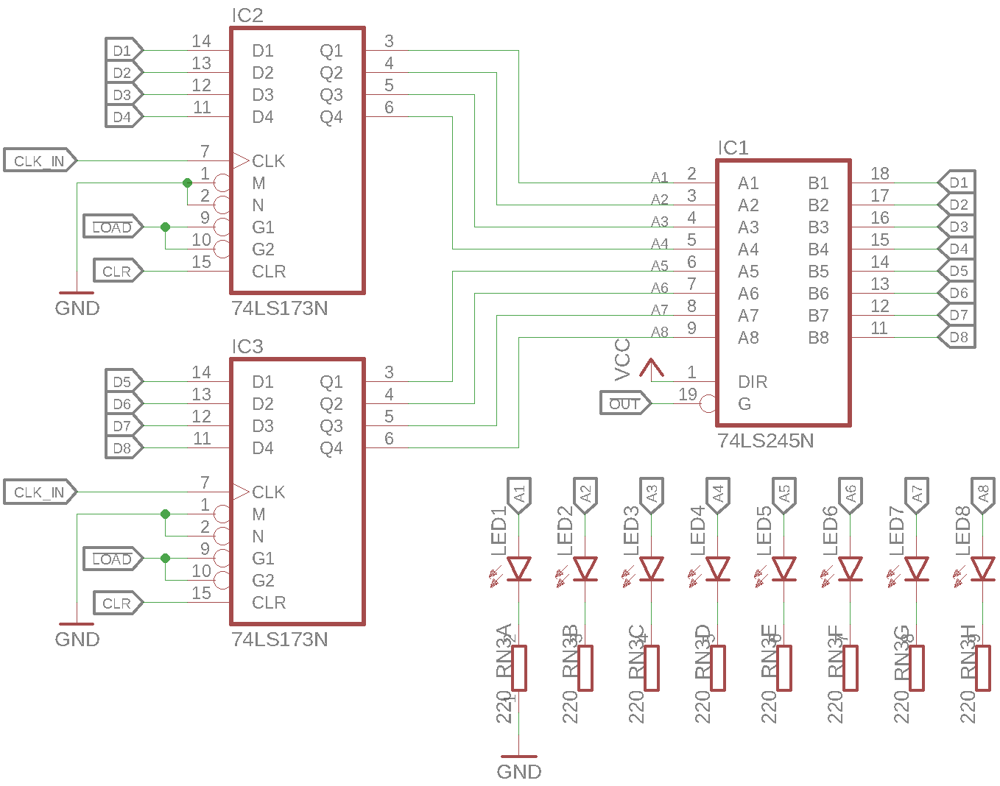

==============================
Data and Instruction Registers
==============================
Since the two **Data Registers A and B (RA & RB)**, as well as the
**Instruction Register (IR)** are very similar in their operation
as well as their schematic, they are all described in this section.
However, differences are highlighted were apropriate.

Mode of Operation
=================

Data Input
----------
Each data register consists of 2
`74LS173 <http://www.ti.com/lit/ds/symlink/sn54173.pdf>`_ ICs which are
*4-bit D-type registers* to form an 8-bit register.
The two registers share the **clock** (:math:`\mathit{CLK}`), **load**
(:math:`\mathit{\overline{LOAD}}`) and **clear** (:math:`\mathit{CLR}`)
signals.
The register inputs are tied to the **databus (DB)** pins.
Thus, when the :math:`\mathit{\overline{LOAD}}` signal is active, the registers
store whatever value is on the DB at the next rising edge of the
:math:`\mathit{CLK}`.

Data Output
-----------
A register also needs to be able to output the value it stored to the DB.
However, since only a single module should drive the DB at any time,
the registers outputs can't be directly connected to the DB lines.
Although the 74LS173 ICs have 3-state outputs, it's enable lines are
tied to ground and thus always active.
Instead, a `74LS245 <http://www.ti.com/lit/ds/symlink/sn54ls245-sp.pdf>`_
*Octal Bus Tranciever* is used as a 3-state buffer.
This has the advantage that it is possible to display the register content
on the :math:`\mathrm{LED}_{1-8}` without driving the DB.

The 74LS245 outputs are enabled by the active-low **output** line
(:math:`\mathit{\overline{OUT}}`) which will out the register data onto
the DB.

Register Pecularities
---------------------

Data Register A (RA)
++++++++++++++++++++
The register described above and the schematic below match the implementation
of Register A directly.

Data Register B (RB)
++++++++++++++++++++
Register B is similar to Register A, however it's output line is not connected
to the control word, to the register can not be read from the DB.
This also means that :math:`\mathit{RB:IC_1}` does not actually need to be
populated.

Instruction Register (IR)
+++++++++++++++++++++++++
The Instruction Register is similar to Register A, however only the lower
nibble is connected to the databus on it's output. This means that, while
the whole register can be set via the DB, only the lower nibble can be read
back.
This behaviour is used to only read back the instrctions data part (ID) when
using parametrized instructions.
For more information on the ID, see the
`Instruction Set Architecture <../isa.html>`_.

Schematic
=========

