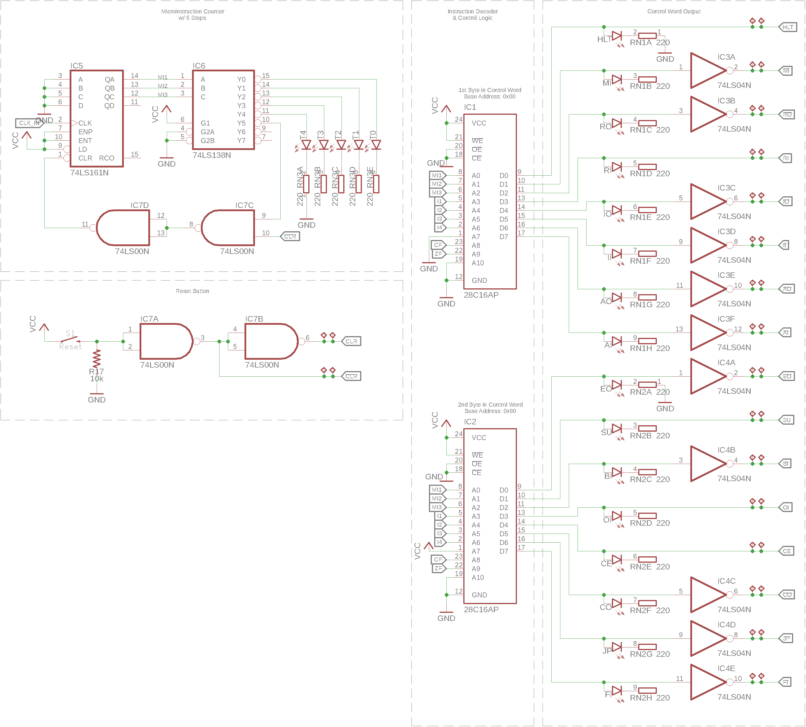

========================
Instruction Decoder (ID)
========================
The instruction decoders job is to generate the control word (CW) which
consists of the control lines of the other modules thus controlling the
behaviour of the processor and all its submodules.
The control word is created based on the current instruction, the
microinstruction in this instruction and the state of the processors flags.

Mode of Operation
=================

The instrcution decoder uses 2
`28C16 <http://cva.stanford.edu/classes/cs99s/datasheets/at28c16.pdf>`_
*2K x 8-bit parallel EEPROMs* to decode the combination of the 4 instruction
bits :math:`\mathrm{I_1} - \mathrm{I_4}`, the micro instruction counter
:math:`\mathrm{MI_1} - \mathrm{MI_3}` and the flags :math:`\mathrm{CF}` and
:math:`\mathrm{ZF}` to a 16-bit control word.
The address line :math:`\mathrm{A_7}` is pulled low for :math:`\mathrm{IC_1}`
while tied to VCC for :math:`\mathrm{IC_2}`.
This way it is possible to flash both EEPROMs with the same lookup table for
instruction decoding.

CW Lookup Table
+++++++++++++++
The control word for each microinstruction for all instructions is described in
the `instruction set architecture <../isa.html>`_.

Microinstruction Counter
++++++++++++++++++++++++
The current microinstruction step is counted by a
`SN74LS161 <http://www.ti.com/lit/ds/symlink/sn74ls161a.pdf>`_
*4-bit syncronous counter* of which only 3 bits are used to count the 5
possible number of microsteps.
The outputs :math:`\mathrm{Q_A} - \mathrm{Q_C}` of the counter are decoded
using a `SN74LS138 <http://www.ti.com/lit/ds/symlink/sn74ls138.pdf>`_
*3-line to 8-line* decoder.
The output of the 6th decoded line is fed through a dual NAND gate to form
an OR gate with inverted inputs.
Thus the counter will be reset to zero, immediately after reaching the value 6,
effectivley counting 0-5.
The second input to the first NOR gate implements a active-low reset signal
for the counter connected to the reset circuit.

Active High Control Word
++++++++++++++++++++++++
Some lines in the CW are active-low.
To normalize the behaviour of all control lines, to active high, the 2
inverters :math:`\mathrm{ID\colon IC_3}` and :math:`\mathrm{ID\colon IC_4}`
are used to flip the polarity of the active low signals before outputting.
This makes programming of the instruction decoder easier.

System Reset
++++++++++++
The control word module also contains the reset circuit which controls the
:math:`\mathrm{CLR}` signal and it's logical inverse
:math:`\overline{\mathrm{CLR}}` that is used for modules with an active-low
clear line.

To buffer the signal of the reset button and invert it's state, the 2 remaining
NAND gates of the microinstruction counter are used.

Schematic
=========

