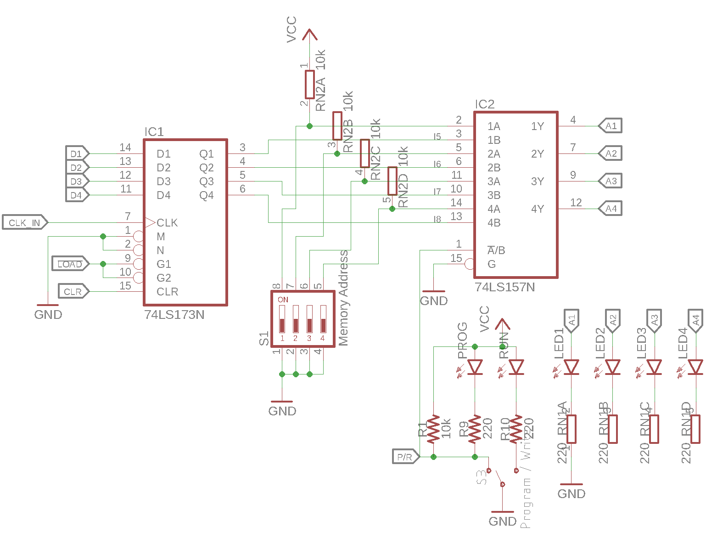

=============================
Memory Address Register (MAR)
=============================
The memory address register stores the address of the data
the `RAM <ram.html>`_ module should be pointing at.

Mode of Operation
=================
The memory address register is very similar in its operation
principle to any of the `data registers <datareg.html>`_.

It uses the same `74LS173 <http://www.ti.com/lit/ds/symlink/sn54173.pdf>`_
*4-bit D-type registers*, however since it's output is not connected
to the databus but instead directly to the address pins of the RAM module,
no buffers are used at the output.

Instead a `74LS157 <http://www.ti.com/lit/ds/symlink/sn54157.pdf>`_
*quadruple 2-to-1 multiplexer* is used to select either the
register contents or a DIP switch array to set the address outputs.
The DIP switches can be used in **program mode** to set the address manually
while in **run mode** the address can be loaded as the lower 4 bits
of the data bus which represent the instruction data (ID) nibble of
an instruction (see the `ISA <../isa.html>`_ section for more detail).

To select the current mode of operation (run / program), the SPDT switch
**Program / Run** can be used.

Schematic
=========

